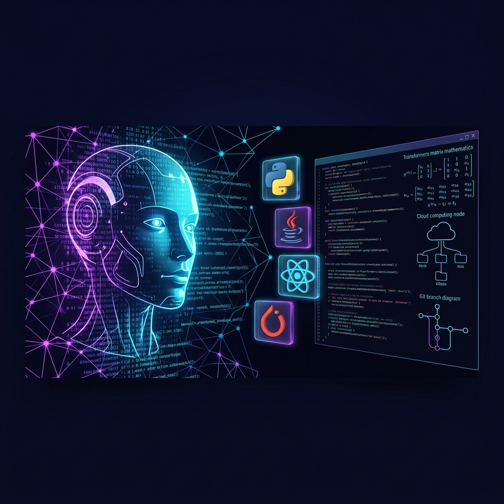

  <!-- Header Wave Graphic -->
  

  <!-- Animated Wave & Heading -->
  <h1>
     
    Hi, I'm 
    Subhash Adireddy
  </h1>

  

    <strong style="color: #06B6D4; font-size: 1.1em;">AI Engineer | Full Stack Developer</strong>
  

  <!-- Animated Typewriter Effect -->
  

    

  <!-- Quick Badges -->
  

    
    
    
  

<!-- ========================================== -->
<!-- SECTION 2: CUSTOM AI BANNER                -->
<!-- ========================================== -->

  

 

<!-- ========================================== -->
<!-- SECTION 3: ABOUT ME (GLASSMorphism CARD)   -->
<!-- ========================================== -->
<h2 align="center">
  ⚡ About Me
</h2>

<table width="100%" style="border-collapse: collapse; border: none;">
  <tr>
    <td width="50%" valign="top" style="border: 1px solid #7C3AED33; background-color: #09090B; padding: 20px; border-radius: 12px;">
      <h3 style="color: #06B6D4; margin-top: 0;">🎓 Academic &amp; Profile</h3>
      <ul style="color: #E2E8F0; line-height: 1.8;">
        <li>🎓 <strong>Final Year B.Tech</strong> Student</li>
        <li>💻 <strong>AI Engineer</strong> specializing in Generative Models</li>
        <li>🚀 <strong>Full Stack Developer</strong> building modern web apps</li>
        <li>⚡ Passionate about building <strong>real-world AI products</strong></li>
        <li>📍 Based in <strong>India 🇮🇳</strong></li>
      </ul>
    </td>
    <td width="50%" valign="top" style="border: 1px solid #06B6D433; background-color: #09090B; padding: 20px; border-radius: 12px;">
      <h3 style="color: #7C3AED; margin-top: 0;">🌱 Currently Learning &amp; Researching</h3>
      <ul style="color: #E2E8F0; line-height: 1.8;">
        <li>🤗 <strong>Transformers Architecture</strong> &amp; Self-Attention Mechanisms</li>
        <li>🧠 <strong>Large Language Models (LLMs)</strong> &amp; Quantization</li>
        <li>🔍 <strong>Retrieval-Augmented Generation (RAG)</strong> Systems</li>
        <li>🤖 <strong>Agentic AI Frameworks</strong> &amp; Multi-Agent Workflows</li>
      </ul>
    </td>
  </tr>
</table>

 

<!-- ========================================== -->
<!-- SECTION 4: CURRENT ROADMAP                -->
<!-- ========================================== -->
<h2 align="center">
  🛣️ Current Roadmap
</h2>

<table width="100%" style="border-collapse: collapse;">
  <tr style="background-color: #09090B;">
    <th width="33%" style="border: 1px solid #7C3AED33; padding: 12px; color: #10B981;">✅ Mastered</th>
    <th width="33%" style="border: 1px solid #06B6D433; padding: 12px; color: #06B6D4;">🚀 Active Focus</th>
    <th width="34%" style="border: 1px solid #7C3AED33; padding: 12px; color: #F59E0B;">⏳ Upcoming Milestones</th>
  </tr>
  <tr>
    <td style="border: 1px solid #7C3AED22; padding: 15px; color: #E2E8F0; background-color: #09090B;">
      ✔ Java &amp; Core Fundamentals 
      ✔ Data Structures &amp; Algorithms 
      ✔ Full Stack Web Development 
      ✔ React &amp; Modern Frontend 
      ✔ Node.js &amp; REST APIs 
      ✔ MongoDB &amp; Database Design
    </td>
    <td style="border: 1px solid #06B6D422; padding: 15px; color: #E2E8F0; background-color: #09090B;">
      🚀 Transformers Architecture 
      🚀 Large Language Models (LLMs) 
      🚀 Vector Search &amp; Advanced RAG 
      🚀 Autonomous AI Agents &amp; Workflows
    </td>
    <td style="border: 1px solid #7C3AED22; padding: 15px; color: #E2E8F0; background-color: #09090B;">
      ⏳ LLM Fine-Tuning (LoRA / QLoRA) 
      ⏳ Model Context Protocol (MCP) 
      ⏳ Enterprise AI Deployment &amp; MLOps
    </td>
  </tr>
</table>

 

<!-- ========================================== -->
<!-- SECTION 5: GITHUB STATISTICS              -->
<!-- ========================================== -->
<h2 align="center">
  📊 GitHub Statistics
</h2>

  <table border="0" style="border-collapse: collapse; background-color: transparent;">
    <tr>
      <td valign="top" align="center" style="padding: 5px;">
        
      </td>
      <td valign="top" align="center" style="padding: 5px;">
        
      </td>
    </tr>
    <tr>
      <td colspan="2" align="center" style="padding: 10px 5px 5px 5px;">
        
      </td>
    </tr>
  </table>

 

<!-- ========================================== -->
<!-- SECTION 6: TECH STACK MATRIX               -->
<!-- ========================================== -->
<h2 align="center">
  🛠️ Tech Stack
</h2>

  <!-- Programming Languages -->
  <h4 style="color: #06B6D4; margin-bottom: 8px;">💻 Programming Languages</h4>
  

    
    
    
  

  <!-- Frontend Development -->
  <h4 style="color: #7C3AED; margin-bottom: 8px;">🎨 Frontend Development</h4>
  

    
    
    
    
    
    
  

  <!-- Backend Development -->
  <h4 style="color: #06B6D4; margin-bottom: 8px;">⚙️ Backend Development</h4>
  

    
    
    
  

  <!-- Databases & Storage -->
  <h4 style="color: #7C3AED; margin-bottom: 8px;">🗄️ Databases &amp; Storage</h4>
  

    
    
    
  

  <!-- AI & Vector DBs -->
  <h4 style="color: #06B6D4; margin-bottom: 8px;">🤖 AI, Machine Learning &amp; Vector DBs</h4>
  

    
    
    
    
    
    
    
  

  <!-- Tools & Platforms -->
  <h4 style="color: #7C3AED; margin-bottom: 8px;">🧰 Tools &amp; Cloud Infrastructure</h4>
  

    
    
    
    
    
    
    
    
    
  

 

<!-- ========================================== -->
<!-- SECTION 8: GITHUB LANGUAGE ANALYTICS & TROPHIES -->
<!-- ========================================== -->
<h2 align="center">
  📈 Language Breakdown &amp; Trophies
</h2>

  <table border="0" style="border-collapse: collapse;">
    <tr>
      <td align="center" style="padding: 10px;">
        
      </td>
    </tr>
  </table>

 

<!-- GitHub Trophies Wall -->

  <h4 style="color: #06B6D4;">🏆 GitHub Trophies Wall</h4>
  

 

<!-- ========================================== -->
<!-- SECTION 9: AI LEARNING JOURNEY TIMELINE    -->
<!-- ========================================== -->
<h2 align="center">
  🧠 AI Engineering Learning Journey
</h2>

  <table width="90%" style="border-collapse: collapse; background-color: #09090B; border: 1px solid #7C3AED33; border-radius: 12px;">
    <tr>
      <td align="center" style="padding: 20px; color: #E2E8F0;">
        2023 
        &nbsp; ➔ &nbsp; 💻 <b>Programming</b> 
        &nbsp; ➔ &nbsp; ☕ <b>Java</b> 
        &nbsp; ➔ &nbsp; 🌐 <b>Web Development</b> 
          
        ➔ &nbsp; ⚛️ <b>React</b> 
        &nbsp; ➔ &nbsp; 🟢 <b>Node.js</b> 
        &nbsp; ➔ &nbsp; 🍃 <b>MongoDB</b> 
        &nbsp; ➔ &nbsp; 🤗 <b>Transformers</b> 
          
        ➔ &nbsp; 🧠 <b>LLMs</b> 
        &nbsp; ➔ &nbsp; 🔍 <b>RAG Systems</b> 
        &nbsp; ➔ &nbsp; 🤖 <b>AI Agents</b> 
        &nbsp; ➔ &nbsp; ⚡ <b>Building AI Products</b>
      </td>
    </tr>
  </table>

 

<!-- ========================================== -->
<!-- SECTION 10: CODING PROFILES & SOCIALS     -->
<!-- ========================================== -->
<h2 align="center">
  🌐 Coding Profiles &amp; Connect
</h2>

  
  
  
  
  
  

 

<!-- ========================================== -->
<!-- SECTION 11: LATEST GITHUB ACTIVITY         -->
<!-- ========================================== -->
<h2 align="center">
  ⚡ Latest GitHub Activity
</h2>

<!-- RECENT_ACTIVITY:start -->
- ⚡ Committed to `subhashadireddy/subhashadireddy` - *Updated futuristic profile dashboard*
- 🚀 Created repository `subhashadireddy/portfolio`
- 🔀 Opened Pull Request in `subhashadireddy/railwaygo`
<!-- RECENT_ACTIVITY:end -->

 

<!-- ========================================== -->
<!-- SECTION 12: BLOG ARTICLES (AUTO-SYNC)      -->
<!-- ========================================== -->
<h2 align="center">
  ✍️ Latest Publications &amp; Articles
</h2>

<!-- BLOG-POST-LIST:START -->
- 📝 [Understanding Attention Mechanisms in Transformer Architectures](https://medium.com/@subhashadireddy)
- 📝 [Building Autonomous AI Agents with LangChain &amp; Python](https://hashnode.com/@subhashadireddy)
- 📝 [A Complete Guide to Retrieval-Augmented Generation (RAG)](https://medium.com/@subhashadireddy)
<!-- BLOG-POST-LIST:END -->

 

<!-- ========================================== -->
<!-- SECTION 13: NOW WORKING ON                 -->
<!-- ========================================== -->
<h2 align="center">
  🎯 Now Working On
</h2>

<table width="100%" style="border-collapse: collapse;">
  <tr>
    <td width="20%" align="center" style="border: 1px solid #7C3AED33; background-color: #09090B; padding: 15px; border-radius: 8px;">
      🤗 
      <strong style="color: #F8FAFC;">Transformers</strong>
    </td>
    <td width="20%" align="center" style="border: 1px solid #06B6D433; background-color: #09090B; padding: 15px; border-radius: 8px;">
      🧠 
      <strong style="color: #F8FAFC;">LLMs</strong>
    </td>
    <td width="20%" align="center" style="border: 1px solid #7C3AED33; background-color: #09090B; padding: 15px; border-radius: 8px;">
      🔍 
      <strong style="color: #F8FAFC;">RAG</strong>
    </td>
    <td width="20%" align="center" style="border: 1px solid #06B6D433; background-color: #09090B; padding: 15px; border-radius: 8px;">
      🤖 
      <strong style="color: #F8FAFC;">Agentic AI</strong>
    </td>
    <td width="20%" align="center" style="border: 1px solid #7C3AED33; background-color: #09090B; padding: 15px; border-radius: 8px;">
      ☕ 
      <strong style="color: #F8FAFC;">Java DSA</strong>
    </td>
  </tr>
</table>

 

<!-- ========================================== -->
<!-- SECTION 14: ACHIEVEMENTS & CERTIFICATIONS  -->
<!-- ========================================== -->
<h2 align="center">
  🏅 Achievements &amp; Certifications
</h2>

<table width="100%" style="border-collapse: collapse;">
  <tr style="background-color: #09090B;">
    <td width="50%" style="border: 1px solid #7C3AED33; padding: 15px; border-radius: 8px;">
      <h4 style="color: #06B6D4; margin-top: 0;">🏆 Hackathons &amp; Open Source</h4>
      <ul style="color: #E2E8F0;">
        <li>🥇 <strong>Hackathon Winner</strong> - Built AI Transit Management Solution</li>
        <li>⭐ Active contributor to open-source AI &amp; Full-Stack repositories</li>
      </ul>
    </td>
    <td width="50%" style="border: 1px solid #06B6D433; padding: 15px; border-radius: 8px;">
      <h4 style="color: #7C3AED; margin-top: 0;">📜 Certifications</h4>
      <ul style="color: #E2E8F0;">
        <li>🎓 <strong>NPTEL Certified</strong> - Data Structures &amp; Algorithms in Java</li>
        <li>🌐 <strong>Cisco Certified</strong> - Networking &amp; Security Fundamentals</li>
      </ul>
    </td>
  </tr>
</table>

 

<!-- ========================================== -->
<!-- SECTION 15: VISITOR COUNTER               -->
<!-- ========================================== -->

  <h4 style="color: #06B6D4;">👀 Profile Visitors</h4>
  

 

<!-- ========================================== -->
<!-- SECTION 16: CONTRIBUTION SNAKE ANIMATION  -->
<!-- ========================================== -->
<h2 align="center">
  🐍 Contribution Snake
</h2>

  

 

<!-- ========================================== -->
<!-- SECTION 17: RANDOM DAILY AI QUOTE        -->
<!-- ========================================== -->
<h2 align="center">
  💬 Daily AI Thought
</h2>

  <blockquote style="background-color: #09090B; border-left: 4px solid #7C3AED; padding: 15px 20px; color: #E2E8F0; border-radius: 8px; display: inline-block; max-width: 700px;">
    <em>"Artificial Intelligence is not about replacing human wisdom, but augmenting human potential to solve complex challenges."</em>
  </blockquote>

 

<!-- ========================================== -->
<!-- SECTION 18: FOOTER                         -->
<!-- ========================================== -->

  
  
  <h3 style="color: #F8FAFC; margin-top: 20px;">
    ✨ Thanks for visiting! ✨
  </h3>
  
  

    Designed with 💜 and ⚡ by <strong>Subhash Adireddy</strong>
  

  

    
  

